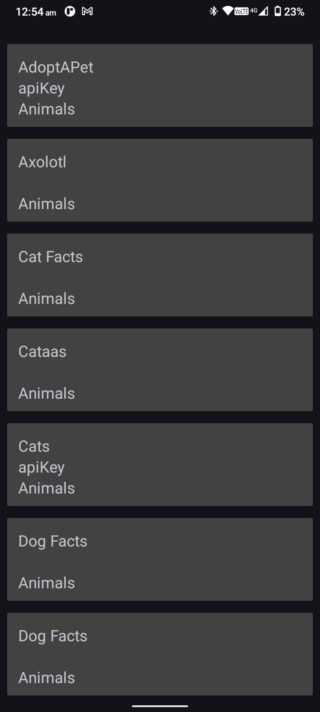

# RxJavaRetrofit :
Android app built with `RxJava` library in java.

## 😎 App Overview
| Screen | Preview |
| :----- | :------:|
|  **MainScreen** _(Default destination)_   • Call Log screen will display today's,yesterday's and older call logs. |  |
|        |
|  **DetailsScreen**    • Call History screen will display all logs with specific contact.  • It display call type with image. • It display call date ,time and duration |  |

## 🛠 Build With
- #Java 
- #Retofit 
- #OkHttp 
- #Viemodel
- #ViewBinding
- #DataBinding
