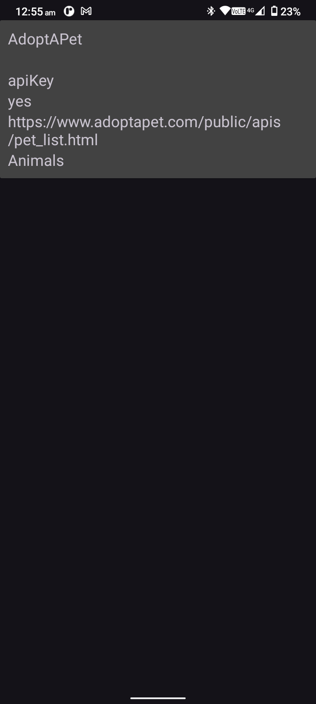

# RxJavaRetrofit :
Android app built with `RxJava` library in java.

## 😎 App Overview
| Screen | Preview |
| :----- | :------:|
|  **MainScreen** _(Default destination)_   • Show short details from api fetch. |  |
|        |
|  **DetailsScreen**    • Details for each entry of row |  |

## 🛠 Build With
- #Java 
- #Retofit 
- #OkHttp 
- #RxJava3
- #Viemodel
- #ViewBinding
- #DataBinding
